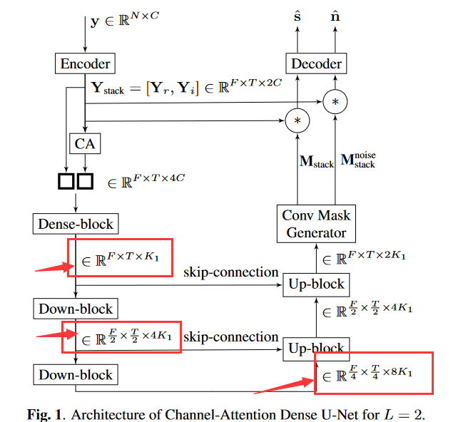

# CA-Dense-UNet
An unofficial code reproduction of **Channel Attention Dense U-Net for Multichannel Speech Enhancement**[1]

[1]Tolooshams B, Giri R, Song A H, et al. Channel-attention dense u-net for multichannel speech enhancement[C]//ICASSP 2020-2020 IEEE International Conference on Acoustics, Speech and Signal Processing (ICASSP). IEEE, 2020: 836-840.

